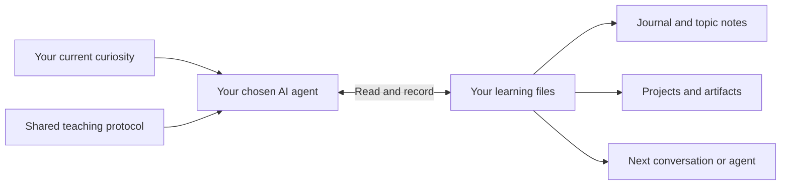

<p align="center">
  
</p>

# Open Teacher

**Follow your curiosity. Keep your learning.**

An open, file-based protocol for AI learning companions with persistent memory.
Explore any topic, save what matters, and bring your learning history to your next
conversation—even with a different agent.

[Get started](#start-with-one-question) · [Read the protocol](PROTOCOL.md) ·
[How it works](docs/how_it_works.md) · [Contribute](CONTRIBUTING.md)

**Draft 0.1 · MIT licensed · Plain files · No required server or database**

## Your curiosity does not need a syllabus

Ask about a mathematical idea today, a painting tomorrow, and a recipe next week.
Go deep, switch directions, or return months later. Open Teacher gives the agent
a way to preserve your questions, useful explanations, attempts, and discoveries
without turning every conversation into a course.

**The conversation is flexible. The memory has a home.**

## What it offers

| | What you get |
| --- | --- |
| **Any topic, any direction** | Your current question leads. Courses, quizzes, projects, and review routines are optional. |
| **Memory beyond a chat** | Save meaningful context and unfinished questions so another conversation can pick them up. |
| **A shared home for different agents** | Common instructions and records, with entry points for Codex and Claude Code. Other file-capable agents can read `AGENTS.md`. |
| **A record you can inspect and correct** | Human-readable notes distinguish what was explained, what felt clear, and what you demonstrated. |
| **Learning you can keep** | Preserve slides, code, diagrams, experiments, and their editable sources alongside the relevant notes. |
| **Projects when they help** | Connect several artifacts to one goal without making every question a project. |
| **Teaching that adapts** | Discover reusable teaching skills, including visual explanations; keep personal feedback separate from the framework. |
| **Your files, your choices** | Local Markdown, relative links, and a blank learner workspace. Personal data is ignored by Git by default. |

## Start with one question

```bash
git clone https://github.com/functicons/open-teacher.git
cd open-teacher
```

Open your file-capable AI agent in that directory and say:

> Read AGENTS.md and use Open Teacher. I'd like to understand something: why do
> some musical notes sound good together?

The agent creates blank personal records from `metadata/templates/initial_user_data/`
when your first learning conversation begins. There is no required onboarding form,
curriculum, account with Open Teacher, or application to launch. Your chosen agent
still needs its own setup, access to the files, and any credentials it normally uses.

Next time, you can ask:

- “Something completely different: how do trees move water upward?”
- “What have we explored so far?”
- “Return to the music question. Where did I get stuck?”
- “Make a visual explanation I can keep.”
- “I only solved that with help—please correct the record.”
- “Don't save this conversation.”

To switch agents, open the **same up-to-date workspace** and ask the next agent to
read `AGENTS.md`. It retrieves the relevant records instead of requiring the old
chat. See [setup and privacy](docs/getting_started.md) for separate machines and
private versioning.

## A small protocol, a flexible teaching experience



The protocol defines how to retrieve context, save meaningful checkpoints,
attribute learning evidence, and resume across agents. It does not prescribe a
subject, lesson sequence, teaching persona, or fixed conversation format.

This repository is the **reference implementation**: instructions, optional
templates, a teaching skill, and a handoff checklist. No additional service is
required by the framework. Optional artifact tools may have their own dependencies.

## Inside the workspace

```text
AGENTS.md / CLAUDE.md       Agent entry points
PROTOCOL.md                Open Teacher Protocol, draft 0.1
metadata/                  Reusable instructions, skills, and blank templates
  teacher_instructions.md  Operational teaching and memory guidance
  skills/                  Discoverable teaching methods
  templates/               Optional record shapes and blank starter
  checks/                  Behavioral handoff checks
user_data/                 Created locally for you; ignored by Git
  memory/                  Profile, navigation, teaching feedback
  journal/                 Dated learning events
  knowledge/               Explanations, evidence, questions, continuation
  projects/                Optional goals spanning multiple artifacts
  artifacts/               Slides, code, diagrams, and other material
```

Templates help agents organize records; you do not need to fill them out.
The [reference knowledge format](metadata/templates/knowledge_note.md) uses a
small OKF v0.2 convention. The core protocol does not require that schema or
make every record a knowledge-base entry.

## Honest memory, not automatic mastery

A clear explanation is valuable. So is saying “I still don't get it.” Neither is
proof that you can apply the idea independently. Open Teacher asks agents to keep
these distinctions visible and link observations to their evidence.

The framework is instruction-based: behavior depends on the agent following the
protocol. It cannot recover unsaved conversations, guarantee every write, or sync
different computers automatically. Local storage also does not mean your chosen
AI provider never receives content. [Compatibility and limits](docs/compatibility.md).

## Help shape an open protocol

Draft 0.1 is a community proposal, not a ratified standard or a certification.
The entry points are designed for file-capable agents; a compatibility claim
should be backed by a documented handoff trial.

Contributions are welcome: better teaching methods, small reproducible handoff
cases, accessible visual explanations, and adapters that keep the same memory
contract. Bring synthetic examples rather than personal learning histories.

[Contribution guide](CONTRIBUTING.md) ·
[Handoff checklist](metadata/checks/memory_handoff.md) · [MIT license](LICENSE)
