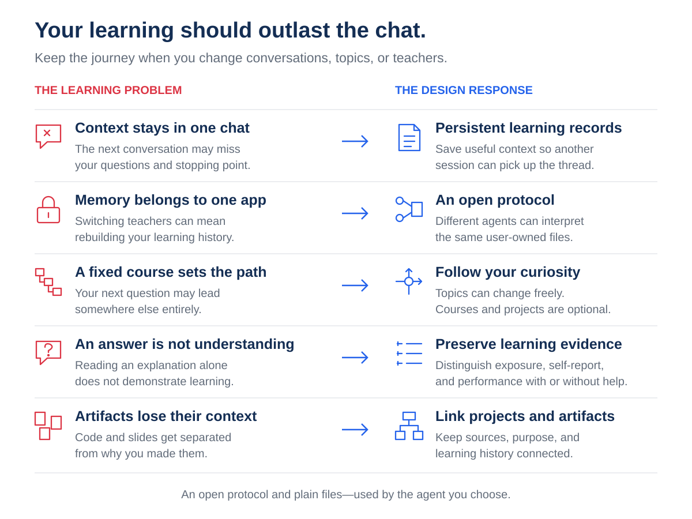
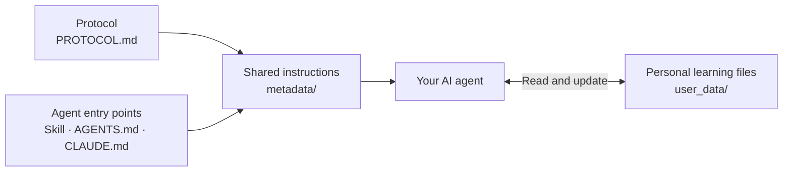

# Open Teacher

**An open protocol for persistent learning memory across AI agents.**

[Getting Started](#getting-started) · [Install the skill](docs/install_skill.md) ·
[Read the standard](PROTOCOL.md) · [View the slides](docs/introduction.pdf)

## What

Open Teacher is **an open standard for learning memory**. It helps Codex, Claude
Code, or another compatible agent remember what you’ve explored, where you got
stuck, and where to continue.

**Your agent teaches. Your files preserve the journey.** Open Teacher supplies
the shared instructions and memory conventions; you choose the agent.

## Why

A chatbot can explain an idea, but a conversation alone is not a durable learning
record. What clicked, where you struggled, and what you built can stay scattered
across chats. A dedicated teaching agent may retain that context, but if its memory
belongs to one app, changing tools can mean rebuilding your learning history.

**Your learning should outlast a chat—and remain yours when you change teachers.**

That is why Open Teacher is a protocol you bring to your preferred agent. The
agent provides the model and tools; the reference workspace provides inspectable
files without requiring a separate tutoring service or database.

[Read the design rationale →](docs/overview.md#why-these-design-choices)

## How

Open Teacher separates **the memory contract**, **reusable teaching instructions**,
and **your personal learning files**. Your existing agent executes the workflow.

- **Protocol:** defines what records mean, how learning evidence is represented,
  and what must survive a handoff. It allows different implementations and layouts.
- **Shared instructions:** the reference workspace routes agents to the same
  teaching and memory rules. The installable skill bundles those rules and blank
  templates; it does not maintain a separate teaching policy.
- **Persistent files:** Markdown records hold learner context, knowledge, dated
  logs, and project state. Artifacts retain their editable sources and outputs.
  Indexes and relative links connect them; personal data stays separate from the framework.

At each session, the agent reads learner context and indexes, retrieves relevant
records, then saves meaningful checkpoints as you learn. A new agent resumes from
those files without needing the previous chat. **No required server or database**;
file access, reasoning, and tools come from your chosen agent.

[Technical design and memory lifecycle →](docs/how_it_works.md) ·
[Protocol requirements →](PROTOCOL.md)

## Getting Started

**Using the skill:** [install it](docs/install_skill.md), then ask:

> Use open-teacher. Create a new learning workspace at ~/learning/my_notes,
> then help me explore a topic I choose.

**Using a workspace:** [open the reference workspace](docs/getting_started.md)
(or one you already created), then ask:

> Read AGENTS.md. Help me understand something I’m curious about, and keep useful
> learning context so we can continue later.

To switch agents, open the **same current learning directory** with the next one.

## Explore further

| I want to… | Go here |
| --- | --- |
| See the idea | [Visual introduction](docs/introduction_readme.md) · [Project overview](docs/overview.md) |
| Set up my agent | [Install the skill](docs/install_skill.md) · [Compatibility](docs/compatibility.md) |
| Understand the records | [How it works](docs/how_it_works.md) |
| Build an implementation | [Draft specification](PROTOCOL.md) |
| Improve Open Teacher | [Contribute](CONTRIBUTING.md) |

**Draft 0.1 · Independent community proposal · [MIT licensed](LICENSE)**

Behavior depends on the agent following the instructions. Files must be shared
between agents; synchronization is not automatic. [Scope and limits](docs/compatibility.md).
