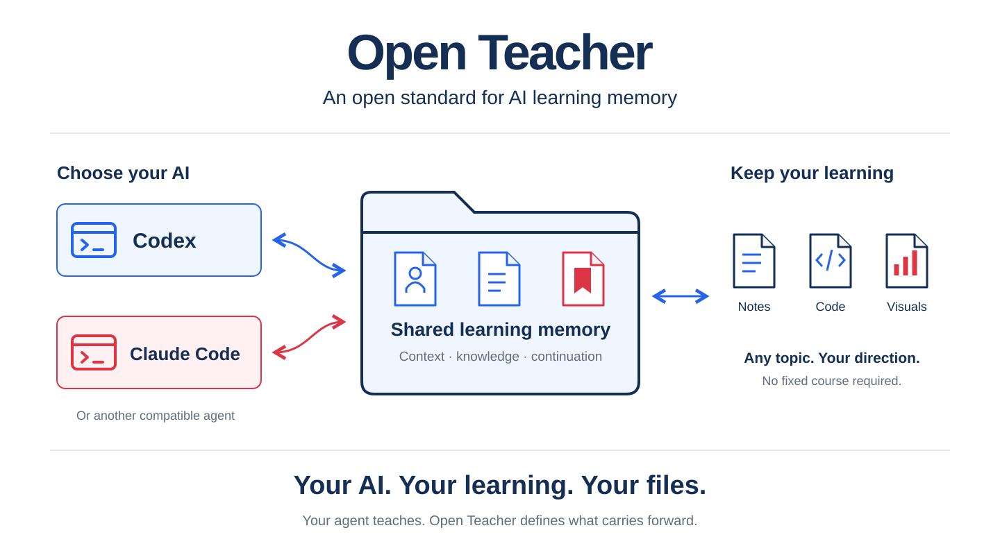
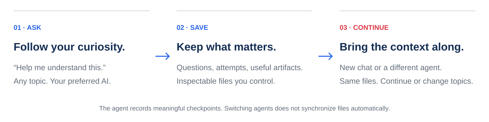

# Open Teacher

**Turn your AI agent into a teacher that remembers.**

[Getting Started](#getting-started) · [Install the skill](docs/install_skill.md) ·
[Read the standard](PROTOCOL.md) · [View the slides](docs/introduction.pdf)

## What

Open Teacher is **an open standard for learning memory**. It helps Codex, Claude
Code, or another compatible agent remember what you’ve explored, where you got
stuck, and where to continue.

**Your agent teaches. Your files preserve the journey.** Open Teacher supplies
the shared instructions and memory conventions; you choose the agent.

## Why

A useful explanation, an unfinished question, or a project can get buried in one
conversation. The next chat—or a different agent—may lack that context.

- **Keep your progress:** preserve questions, attempts, and useful artifacts.
- **Choose your teacher:** carry the same learning files between compatible agents.
- **Follow your curiosity:** explore any topic without a required course or syllabus.

[The problem and the idea →](docs/overview.md)

## How

The agent records meaningful checkpoints in your workspace: **learner context,
knowledge, logs, projects, and artifacts**. The next agent reads the relevant files
to continue. Records distinguish what was explained from what you demonstrated.

**No required server or database.** [How memory works →](docs/how_it_works.md)

## Getting Started

**Using the skill:** [install it](docs/install_skill.md), then ask:

> Use open-teacher. Create a new learning workspace at ~/learning/my_notes,
> then help me explore a topic I choose.

**Using a workspace:** [open the reference workspace](docs/getting_started.md)
(or one you already created), then ask:

> Read AGENTS.md. Help me understand something I’m curious about, and keep useful
> learning context so we can continue later.

To switch agents, open the **same current learning directory** with the next one.

## Explore further

| I want to… | Go here |
| --- | --- |
| See the idea | [Visual introduction](docs/introduction_readme.md) · [Project overview](docs/overview.md) |
| Set up my agent | [Install the skill](docs/install_skill.md) · [Compatibility](docs/compatibility.md) |
| Understand the records | [How it works](docs/how_it_works.md) |
| Build an implementation | [Draft specification](PROTOCOL.md) |
| Improve Open Teacher | [Contribute](CONTRIBUTING.md) |

**Draft 0.1 · Independent community proposal · [MIT licensed](LICENSE)**

Behavior depends on the agent following the instructions. Files must be shared
between agents; synchronization is not automatic. [Scope and limits](docs/compatibility.md).
