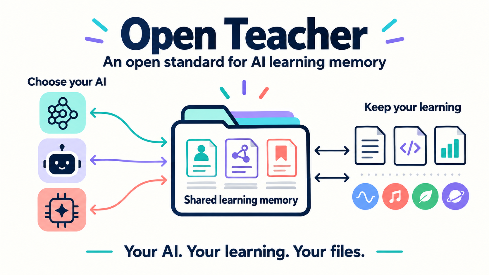
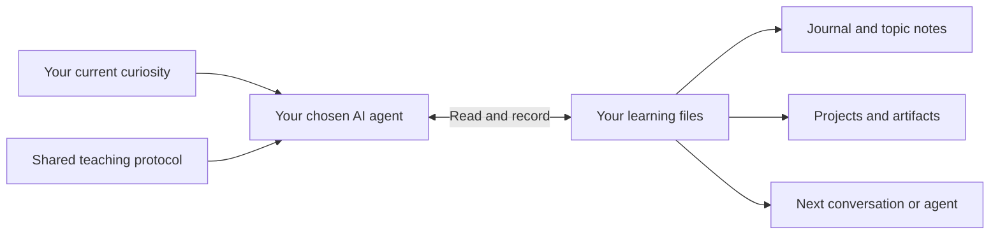

<p align="center">
  
</p>

# Open Teacher

**Follow your curiosity. Keep your learning.**

**An open standard for portable learning memory and AI teaching continuity.**

**Your agent. Your curiosity. Your learning history.**

Learn with the AI agent you prefer, and keep a learning record you can take with
you. Open Teacher defines how agents save useful context, understand what you
have actually learned, and pick up where you left off. The records belong in your
workspace, independent of any one conversation or provider.

Open Teacher is a specification, not an AI agent, model, or hosted tutoring app.
This repository includes a reference workspace you can use with your existing
agent, plus the standard other tools can implement.

[Read the specification](PROTOCOL.md) · [Try the reference workspace](#start-with-one-question) ·
[Visual introduction](docs/introduction_readme.md) · [How it works](docs/how_it_works.md) · [Contribute](CONTRIBUTING.md)

**See the idea in seven slides:** [HTML presentation](docs/introduction.html) ·
[PDF preview](docs/introduction.pdf). Download the HTML and open it in a browser;
GitHub displays its source.

**Draft 0.1 · MIT licensed · Plain files · No required server or database**

## The problem: your learning gets scattered

A useful learning conversation leaves more than answers: the explanation that
finally clicked, the question still bothering you, a mistake you corrected, a
small program or diagram you want to keep.

That context can stay buried in individual chats or tied to a tool's private
memory. Start another conversation or switch providers, and you may need to
explain your background again, recover the useful files, and reconstruct where
you stopped. A transcript alone also doesn't reliably distinguish an explanation
you read from something you can do yourself.

Open Teacher gives that history a shared, inspectable home—and defines how the
next agent should read and update it.

## Choose your agent. Keep your progress.

**Open Teacher does not teach on its own. Your chosen agent does.**

The agent brings its model, tools, explanations, and interaction style. Open
Teacher supplies the common memory and handoff contract: what to record, how to
interpret learning evidence, and how to continue from saved context.

That separation is deliberate. You should be able to change agents as your
preferences and tools evolve without rebuilding your learning history inside each
one. Agent developers can adopt the standard without adopting a particular tutor
persona, UI, model vendor, or course system.

| Your agent provides | Open Teacher standardizes |
| --- | --- |
| Conversation, reasoning, and explanations | How useful learning context is recorded and discovered |
| Tools to make diagrams, slides, or code | How artifacts connect to topics, evidence, and projects |
| A teaching approach suited to your question | How observations distinguish exposure, self-report, and demonstrated understanding |
| Its own interface and model | How another agent can interpret and continue the saved journey |

The reference workspace provides entry points for Codex and Claude Code. Other
agents can participate by reading and writing the shared files and following the
standard, directly or through an integration. This is not a promise that every
chat app can access local files automatically. [Compatibility](docs/compatibility.md).

## Your curiosity does not need a syllabus

Ask about a mathematical idea today, a painting tomorrow, and a recipe next week.
Go deep, switch directions, or return months later. Open Teacher gives the agent
a way to preserve your questions, useful explanations, attempts, and discoveries
without turning every conversation into a course.

**The conversation is flexible. The memory has a home.**

## Why use Open Teacher

| | What you get |
| --- | --- |
| **Freedom to follow curiosity** | Your current question leads. Courses, quizzes, projects, and review routines are optional. |
| **Memory beyond a chat** | Save meaningful context and unfinished questions so another conversation can pick them up. |
| **Freedom to change agents** | Keep the same learning records when you change compatible tools. Your history does not need to live exclusively in one provider's memory. |
| **A record you can inspect and correct** | Human-readable notes distinguish what was explained, what felt clear, and what you demonstrated. |
| **Learning you can keep** | Preserve slides, code, diagrams, experiments, and their editable sources alongside the relevant notes. |
| **Projects when they help** | Connect several artifacts to one goal without making every question a project. |
| **Teaching that adapts** | Discover reusable teaching skills, including visual explanations; keep personal feedback separate from the framework. |
| **Ownership without a new platform** | Read, edit, back up, or privately version ordinary files. No Open Teacher account, server, or database is required; personal data is ignored by Git by default. |

## Start with one question

```bash
git clone https://github.com/functicons/open-teacher.git
cd open-teacher
```

Open your file-capable AI agent in that directory and say:

> Read AGENTS.md and use Open Teacher. I'd like to understand something: why do
> some musical notes sound good together?

The agent creates blank personal records from `metadata/templates/initial_user_data/`
when your first learning conversation begins. There is no required onboarding form,
curriculum, account with Open Teacher, or application to launch. Your chosen agent
still needs its own setup, access to the files, and any credentials it normally uses.

Next time, you can ask:

- “Something completely different: how do trees move water upward?”
- “What have we explored so far?”
- “Return to the music question. Where did I get stuck?”
- “Make a visual explanation I can keep.”
- “I only solved that with help—please correct the record.”
- “Don't save this conversation.”

To switch agents, open the **same up-to-date workspace** and ask the next agent to
read `AGENTS.md`. It retrieves the relevant records instead of requiring the old
chat. See [setup and privacy](docs/getting_started.md) for separate machines and
private versioning.

## A small protocol, a flexible teaching experience



The protocol defines how to retrieve context, save meaningful checkpoints,
attribute learning evidence, and resume across agents. It does not prescribe a
subject, lesson sequence, teaching persona, or fixed conversation format.

Alongside the specification, this repository ships a **reference implementation**:
instructions, optional templates, a teaching skill, and a handoff checklist. No additional service is
required by the framework. Optional artifact tools may have their own dependencies.

## The standard and its reference implementation

| Layer | What it defines | Where to start |
| --- | --- | --- |
| **Open Teacher standard** | Shared meaning for learner context, learning evidence, history, artifacts, and continuation; rules for reading, updating, and handing them off | [Draft specification](PROTOCOL.md) |
| **Reference implementation** | One directory layout, agent instructions, optional templates, and teaching skills that implement the standard | [Use this workspace](#start-with-one-question) |
| **Your implementation** | Your agent, interface, storage layout, and teaching methods, preserving the same record semantics and learner control | [Implementer guidance](PROTOCOL.md#11-producers-consumers-and-portability) |

The standard specifies what must survive a handoff. It leaves the learning
conversation open. You do not need to adopt this repository's exact folder names,
use a particular model, or run a particular application.

## Inside the workspace

```text
AGENTS.md / CLAUDE.md       Agent entry points
PROTOCOL.md                Open Teacher Protocol, draft 0.1
metadata/                  Reusable instructions, skills, and blank templates
  teacher_instructions.md  Operational teaching and memory guidance
  skills/                  Discoverable teaching methods
  templates/               Optional record shapes and blank starter
  checks/                  Behavioral handoff checks
user_data/                 Created locally for you; ignored by Git
  memory/                  Profile, navigation, teaching feedback
  journal/                 Dated learning events
  knowledge/               Explanations, evidence, questions, continuation
  projects/                Optional goals spanning multiple artifacts
  artifacts/               Slides, code, diagrams, and other material
```

Templates help agents organize records; you do not need to fill them out.
The [reference knowledge format](metadata/templates/knowledge_note.md) uses a
small [OKF v0.2](https://github.com/GoogleCloudPlatform/open-knowledge-format/blob/main/SPEC.md)
convention. OKF specifies knowledge representation; Open Teacher specifies learning
records and the agent behavior needed to preserve their meaning. They can be used
together. Open Teacher is independent of OKF and does not require all records to
use its schema.

## Honest memory, not automatic mastery

A clear explanation is valuable. So is saying “I still don't get it.” Neither is
proof that you can apply the idea independently. Open Teacher asks agents to keep
these distinctions visible and link observations to their evidence.

The framework is instruction-based: behavior depends on the agent following the
protocol. It cannot recover unsaved conversations, guarantee every write, or sync
different computers automatically. Local storage also does not mean your chosen
AI provider never receives content. [Compatibility and limits](docs/compatibility.md).

## Help shape the open standard

Open Teacher is an open standard in development. Draft 0.1 is its initial proposal;
it does not claim formal ratification, established adoption, or certification.
The entry points are designed for file-capable agents; a compatibility claim
should be backed by a documented handoff trial.

Contributions are welcome: better teaching methods, small reproducible handoff
cases, accessible visual explanations, and adapters that keep the same memory
contract. Bring synthetic examples rather than personal learning histories.

[Contribution guide](CONTRIBUTING.md) ·
[Handoff checklist](metadata/checks/memory_handoff.md) · [MIT license](LICENSE)
